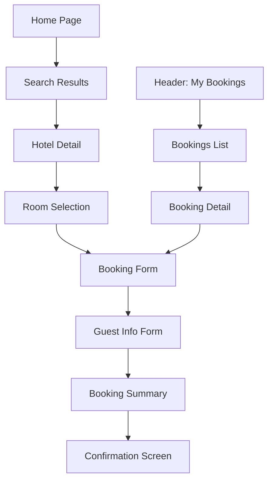

# 🏨 Hotel Booking Components Integration Guide

## 📋 Tổng quan

Hệ thống booking đã được tích hợp hoàn chỉnh với 4 components chính và 6 trang routing. Dưới đây là hướng dẫn chi tiết về cách sử dụng và tích hợp.

## 🧩 Components đã tạo

### 1. **BookingForm** (`src/components/BookingForm.tsx`)
- **Mục đích**: Form tổng hợp đầy đủ cho việc đặt phòng
- **Tính năng**:
  - Hiển thị thông tin hotel & phòng đã chọn
  - Chọn ngày checkin/checkout và số khách
  - Form thông tin khách hàng cơ bản
  - Chọn phương thức thanh toán (Credit Card/PayPal)
  - Sidebar tóm tắt giá và tổng cộng
  - Validation đầy đủ

### 2. **BookingSummary** (`src/components/BookingSummary.tsx`)
- **Mục đích**: Hiển thị thông tin tóm tắt booking chi tiết
- **Tính năng**:
  - Status badges (pending/confirmed/cancelled)
  - Thông tin accommodation, stay details, guest info
  - Pricing breakdown chi tiết
  - Actions khác nhau theo trạng thái booking
  - Edit booking functionality

### 3. **GuestInfoForm** (`src/components/GuestInfoForm.tsx`)
- **Mục đích**: Form nhập thông tin cho nhiều khách
- **Tính năng**:
  - Navigation tabs giữa các khách
  - Primary guest có yêu cầu riêng (email/phone)
  - Validation chi tiết cho từng field
  - Support passport fields (optional)
  - Copy data từ primary guest
  - Summary trạng thái hoàn thành

### 4. **ConfirmationScreen** (`src/components/ConfirmationScreen.tsx`)
- **Mục đích**: Trang xác nhận đặt phòng thành công
- **Tính năng**:
  - Success message với booking ID
  - Quick actions: download, email, print, share
  - Chi tiết đầy đủ về booking
  - Hotel contact information
  - Important information và next steps

## 🛤️ Routing Structure

### Booking Flow
```
Hotel Detail → Room Selection → Booking Flow
```

### Các trang đã tạo:

1. **`/booking`** - Trang booking chính
2. **`/booking/guest-info`** - Trang nhập thông tin khách
3. **`/booking/summary`** - Trang tóm tắt trước khi confirm
4. **`/booking/confirmation`** - Trang xác nhận thành công
5. **`/bookings`** - Trang xem danh sách booking
6. **`/bookings/[id]`** - Trang chi tiết một booking

## 🔄 Flow hoàn chỉnh



## 🔗 Cách sử dụng

### 1. Từ Hotel Detail Page
User chọn phòng và click "Book Now" trong `RoomCard`:
```typescript
// URL sẽ chuyển đến:
/booking?roomId=room-1&hotelId=hotel-1&checkIn=2024-01-15&checkOut=2024-01-17&adults=2&children=0&rooms=1
```

### 2. Navigation Flow
- **BookingForm** → lưu data vào localStorage → navigate đến `/booking/guest-info`
- **GuestInfoForm** → update data → navigate đến `/booking/summary`  
- **BookingSummary** → confirm booking → simulate API → navigate đến `/booking/confirmation`
- **ConfirmationScreen** → cleanup localStorage

### 3. Xem lại Bookings
- Từ Header click "My Bookings" → `/bookings`
- Click vào booking cụ thể → `/bookings/[id]`

## 📊 Data Flow

### 1. Booking Process Data
```typescript
// localStorage key: 'bookingData'
{
  checkIn: string,
  checkOut: string,
  guests: { adults: number, children: number, rooms: number },
  guestInfo: { firstName: string, lastName: string, email: string, phone: string, specialRequests: string },
  paymentMethod: string,
  cardInfo: { number: string, expiry: string, cvv: string, name: string }
}
```

### 2. Confirmation Data
```typescript
// localStorage key: 'confirmationData'
{
  bookingId: string,
  confirmationNumber: string,
  status: 'confirmed',
  bookingDate: string,
  ...bookingData
}
```

## 🎨 UI/UX Features

### ✅ Responsive Design
- Mobile-first approach với Tailwind CSS
- Breakpoints: `sm`, `md`, `lg`, `xl`
- Grid layouts tự động adapt

### ✅ Loading States
- Skeleton loading cho booking details
- Spinner cho API calls
- Disabled states cho buttons

### ✅ Error Handling
- Form validation với error messages
- 404 pages cho invalid bookings
- Graceful fallbacks

### ✅ Accessibility
- ARIA labels và roles
- Keyboard navigation
- Screen reader friendly

## 🔧 Customization

### 1. Thêm Required Fields
```typescript
<GuestInfoForm
  totalGuests={4}
  onGuestsUpdate={handleUpdate}
  showPassportFields={true}
  requiredFields={{
    dateOfBirth: true,
    nationality: true,
    passport: true
  }}
/>
```

### 2. Custom Pricing Logic
Trong các components, bạn có thể thay thế mock pricing bằng logic thực:
```typescript
const calculatePricing = (room, nights, rooms) => {
  const subtotal = room.price * nights * rooms;
  const taxes = subtotal * 0.1; // 10% tax
  const serviceFee = subtotal * 0.05; // 5% service fee
  return { subtotal, taxes, serviceFee, total: subtotal + taxes + serviceFee };
};
```

### 3. API Integration
Thay thế mock data bằng real API calls:
```typescript
// Trong booking pages
const bookingResponse = await fetch('/api/bookings', {
  method: 'POST',
  body: JSON.stringify(bookingData)
});
```

## 🚀 Next Steps

1. **Authentication Integration**: Kết nối với hệ thống đăng nhập
2. **Payment Gateway**: Tích hợp Stripe/PayPal thực tế
3. **Email Notifications**: Gửi email confirmation
4. **Push Notifications**: Thông báo booking status
5. **Admin Panel**: Quản lý bookings từ phía hotel

## 📝 Notes

- Tất cả components đều support internationalization (i18n)
- Mock data được sử dụng cho demo - thay thế bằng API calls thực tế
- LocalStorage được dùng để persist data - có thể thay bằng Redux/Context
- Styling consistent với design system hiện tại 